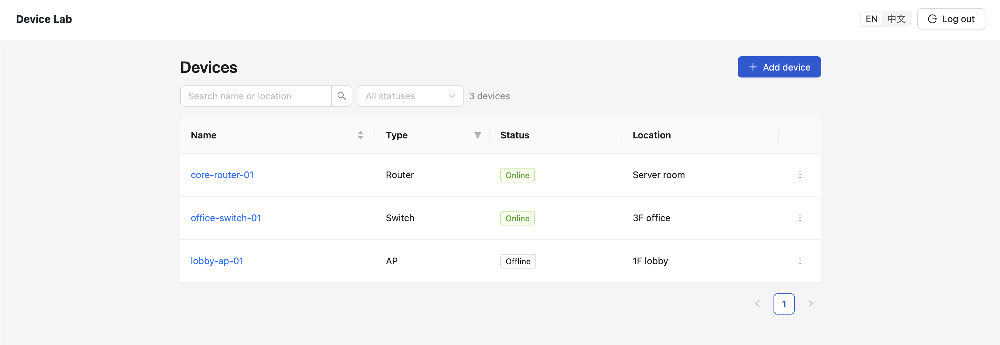
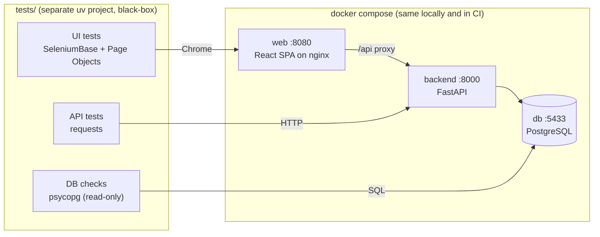
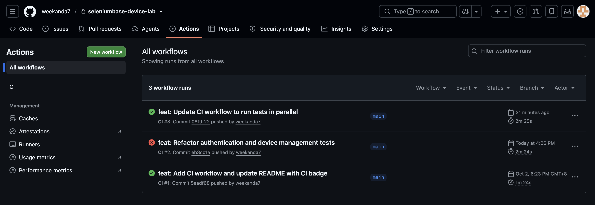
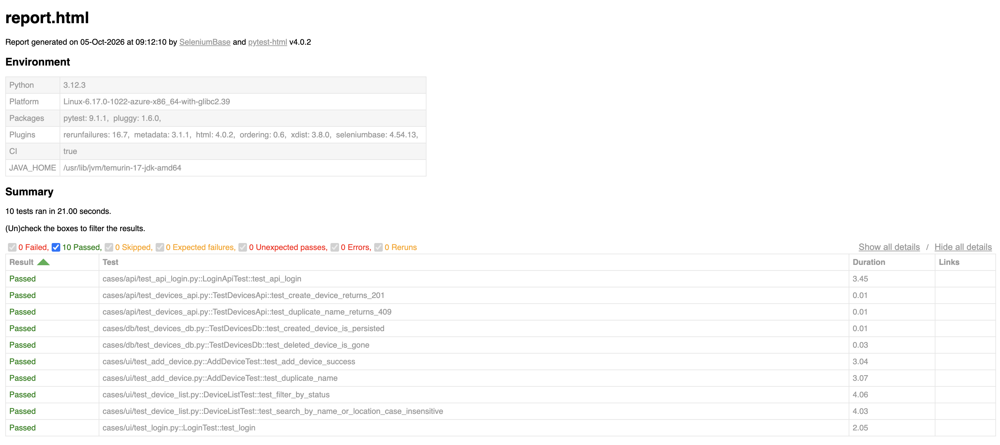

# seleniumbase-device-lab

[](https://github.com/weekanda7/seleniumbase-device-lab/actions/workflows/ci.yml)

A small device-management web app (FastAPI + PostgreSQL + React) **and** a black-box test suite for it:
SeleniumBase UI tests, API tests and DB checks, run in parallel on every push by GitHub Actions.

The app exists to be tested. The interesting part is `tests/`.



## Architecture



- **Black-box**: tests never import app code. They only talk to the three published ports, so the same suite could point at a staging URL by changing env vars (`BASE_URL`, `API_URL`, `DB_DSN`).
- **One environment**: `docker compose up --wait` starts db → backend → web and blocks until every healthcheck is green. Local runs and CI use the exact same command.

## Test design

| Layer | Marker | Tool | What it proves |
|---|---|---|---|
| UI | `ui` | SeleniumBase, Page Objects in `tests/pages/` | A user can log in, search, filter and add devices |
| API | `api` | `requests` | Status codes and response bodies (201, 409, …) |
| DB | `db` | `psycopg` | What the API actually **persisted**, not just what it echoed back |

**Test data**

- Every test creates its own data with a unique `uuid` name and only asserts on that data.
- Setup goes through the API (fast, no UI dependency, still passes the app's validation rules). The DB is only read, never written.
- Cleanup runs even when the test fails: `tearDown` (UI tests) or the `api` fixture (API / DB tests) deletes everything in `created_ids` through the API. Devices created through the UI are looked up by name first.

**Parallel runs**

Because tests share no data and don't depend on order, the whole suite runs with `pytest-xdist -n auto` (one worker per CPU).

**Base classes**

- `NoAuthCase`: starts on the login page.
- `AuthCase`: logs in through the API and puts the token into `sessionStorage`, so UI tests skip the login form.
- Plain method overriding, no abstract classes. With only two subclasses this keeps it simple; the cost is that a subclass must remember to call `super()`.

## Run it

Requires Docker and [uv](https://docs.astral.sh/uv/).

```bash
make up                                   # start db + backend + web, wait for healthchecks
cd tests
uv run pytest --headless -n auto          # everything, in parallel
uv run pytest -m ui --headed              # only UI tests, watch the browser
uv run pytest -m "api or db"              # no browser needed
cd .. && make down                        # stop and wipe the DB (next `up` starts from 3 seed devices)
```

Reports: `tests/report/report.html` (pytest-html) and `report.xml` (JUnit).

| URL | What |
|---|---|
| http://localhost:8080 | Web UI (login: see `.env.example`) |
| http://localhost:8000/docs | API docs (Swagger) |
| `localhost:5433` | PostgreSQL (`devicelab` / `devicelab`) |

## CI

`.github/workflows/ci.yml` runs two jobs on every push and pull request:

1. **lint**: ruff (backend, tests) and ESLint / Prettier (frontend).
2. **test**: `docker compose up -d --build --wait` → `pytest --headless -n auto` → upload the HTML / JUnit report as an artifact. On failure it also dumps the container logs.




## Layout

```
backend/            FastAPI: api / application / domain / infrastructure layers
frontend/           React + Vite SPA, served by nginx (proxies /api to the backend)
tests/
  base/             NoAuthCase / AuthCase, uuid_name
  pages/            Page Objects (static methods taking `sb`; shared parts in pages/common)
  api_apiserver/    Auth + DeviceApi clients
  db_client/        read-only Postgres queries
  cases/{ui,api,db} the tests; cases/conftest.py has the `api` fixture
docker-compose.yml
.github/workflows/ci.yml
```

## Roadmap

- **Selenium Grid in CI**: move Chrome out of the runner into a `selenium/standalone-chrome` service container.
  The browser reaches the app through the host (`--add-host=host.docker.internal:host-gateway`,
  `BASE_URL=http://host.docker.internal:8080`); SeleniumBase connects with `--server=localhost --port=4444`.
  Trade-off: the browser's network path differs from local runs, accepted to match a typical production-like setup.
- **Typed test inputs**: device status / type as `Enum` instead of strings.
- **TypeScript test layer**: component tests (Vitest) or a Playwright TS e2e for the React frontend.
- **Test management**: push results from `report.xml` (JUnit) to TestRail, so each run maps to test cases and runs there.
- **Cross-browser / real devices**: run the same suite on BrowserStack through its Selenium hub (`--server` / `--port` plus capabilities), no code changes in the tests.
- **Published report**: deploy `report.html` to GitHub Pages on every `main` build, so the latest result has a stable URL instead of a downloadable artifact.
